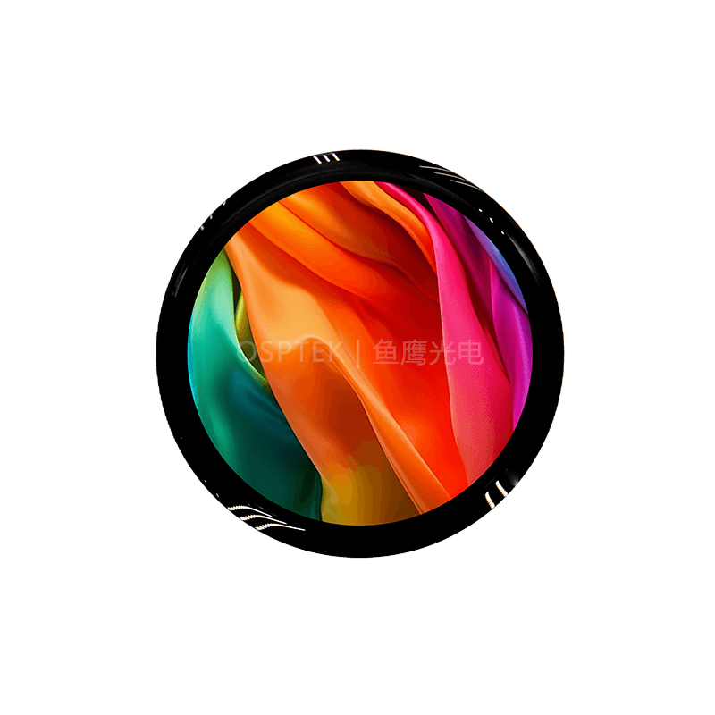

<p align="left"></p>

<h1 align="center">OSPTEK 1.39″ AMOLED 454×454（SH8601 · QSPI）</h1>

<p align="center"><b>圆形 AMOLED 模组 · QSPI · SH8601</b></p>

<p align="center"><a href="./README_EN.md">English</a> | 简体中文</p>

<p align="center">
  
  
  
  
</p>

<p align="center"></p>

## 目录

- [产品简介](#产品简介)
- [规格参数](#规格参数)
- [示例工程](#示例工程)
- [仓库结构](#仓库结构)
- [相关资料](#相关资料)
- [购买链接](#购买链接)
- [技术支持](#技术支持)

---

## 产品简介

OSPTEK **1.39 寸 454×454 AMOLED** 是一款 **QSPI** 接口彩色显示模组，显示驱动为 **SH8601**，触摸驱动为 **CST820**。方形分辨率适合穿戴表盘、圆形小屏 HMI 等场景。

规格标识（仓库名）：`1.39-amoled-454x454-qspi-sh8601`

当前模组版本：**AM139Q454454FLS1**。电气与外形细节以 [`docs/AM_139_Q454454_FLS_1_b691bc4634.pdf`](./docs/AM_139_Q454454_FLS_1_b691bc4634.pdf) 为准。

## 规格参数

| 项目 | 规格 |
| ---- | ---- |
| 尺寸 | 1.39 英寸 |
| 类型 | AMOLED（彩色） |
| 分辨率 | 454×454 |
| 接口 | QSPI |
| 驱动 IC | SH8601 |
| 触摸驱动 | CST820 |

> 完整外形尺寸、FPC 定义、供电与时序以产品规格书 / 驱动手册为准。

## 示例工程

| 说明 | 路径 |
| ---- | ---- |
| ESP32-S3 · SH8601 QSPI + LVGL8（触摸 CST820） | [`examples/ESP32-S3-Display_SH8601-QSPI_LVGL-V8/`](./examples/ESP32-S3-Display_SH8601-QSPI_LVGL-V8/) |

## 仓库结构

```text
1.39-amoled-454x454-qspi-sh8601/
├── README.md
├── README_EN.md
├── MODULE_VERSION.md
├── LICENSE
├── images/          # README 用图
├── docs/            # 规格书、驱动手册、初始化等
└── examples/        # 示例工程
```

## 相关资料

### 本产品资料

| 资料 | 链接 |
| ---- | ---- |
| 产品规格书（AM139Q454454FLS1） | [`docs/AM_139_Q454454_FLS_1_b691bc4634.pdf`](./docs/AM_139_Q454454_FLS_1_b691bc4634.pdf) |
| 驱动 IC 数据手册（SH8601） | [`docs/SH_8601_A0_Data_Sheet_Preliminary_UCS_V0_0_191226_1_143481d321.pdf`](./docs/SH_8601_A0_Data_Sheet_Preliminary_UCS_V0_0_191226_1_143481d321.pdf) |
| 初始化序列（文本） | [`docs/[SH8601A]1.39_454x454_User_Initial_QSPI.txt`](./docs/[SH8601A]1.39_454x454_User_Initial_QSPI.txt) |

### 示例工程

- [ESP32-S3 SH8601 QSPI + LVGL8](./examples/ESP32-S3-Display_SH8601-QSPI_LVGL-V8/)

## 购买链接

<p align="center">
  <a href="https://shop110742373.taobao.com/"></a>
  &nbsp;&nbsp;
  <a href="https://www.aliexpress.com/store/1105701619"></a>
</p>

**国内（淘宝）**

- 店铺：[鱼鹰光电工厂店](https://shop110742373.taobao.com/)

**海外（AliExpress）**

- 店铺：[OSPTEK Official Store](https://www.aliexpress.com/store/1105701619)

## 技术支持

- 技术支持 / 产品咨询：<luyu@osptek.com>
- QQ 技术交流群：**985881096**
- 公司官网：<https://osptek.com/>
- 有任何问题，都可以在本仓库 Issues 中提问

---

<p align="center"><sub>© 2026 OSPTEK 鱼鹰光电 · 本仓库资料采用 CC BY 4.0 许可</sub></p>
